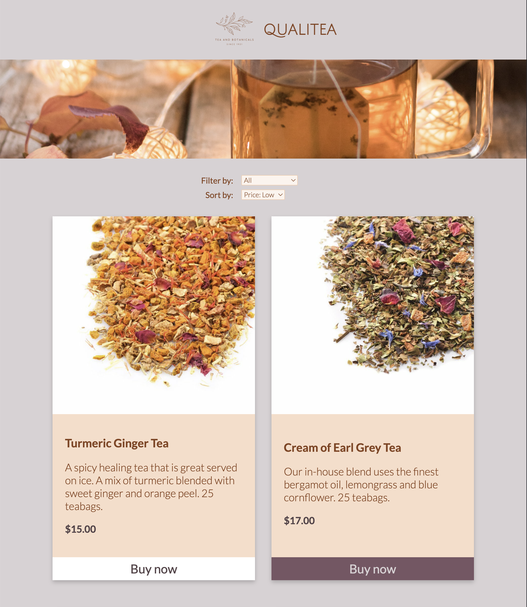

# 01 Project - Online Shop - QUALITEA

An online shop, QUALITEA, selling quality teas and tea accessories, such as teapots and infusers. Customers can select the products they wish to purchase and they will be taken to an online checkout to pay via credit card.

## Dependencies

This project uses the following systems:

- [Stripe](https://stripe.com/)
- [React](https://github.com/facebook/react)
- [Begin](https://begin.com/)

## Dev dependencies

- [Prettier](https://prettier.io/)
- [Stylelint](https://stylelint.io/)

## Prerequisites

- [Node](https://nodejs.org/)

## Local development

1. Run `npm install`
2. Run `npm start` to start the development server
3. Open `src/App.js` to get started

## Deployed applications

- [QUALITEA](https://qualitea.netlify.app/)
- [BEGIN API URL](https://music-2o5-staging.begin.app)

## Citations

- Favicon downloaded from: [Flaticon - Green tea icons created by monkik](https://www.flaticon.com/free-icons/green-tea)
- Product images taken from: [Teadrop](https://www.teadrop.com.au/)
- Header image from: [Unsplash - Photo by Svitlana](https://unsplash.com/@kekse_und_ich?utm_source=unsplash&utm_medium=referral&utm_content=creditCopyText)
- Logo created on: [Canva](https://www.canva.com/)
