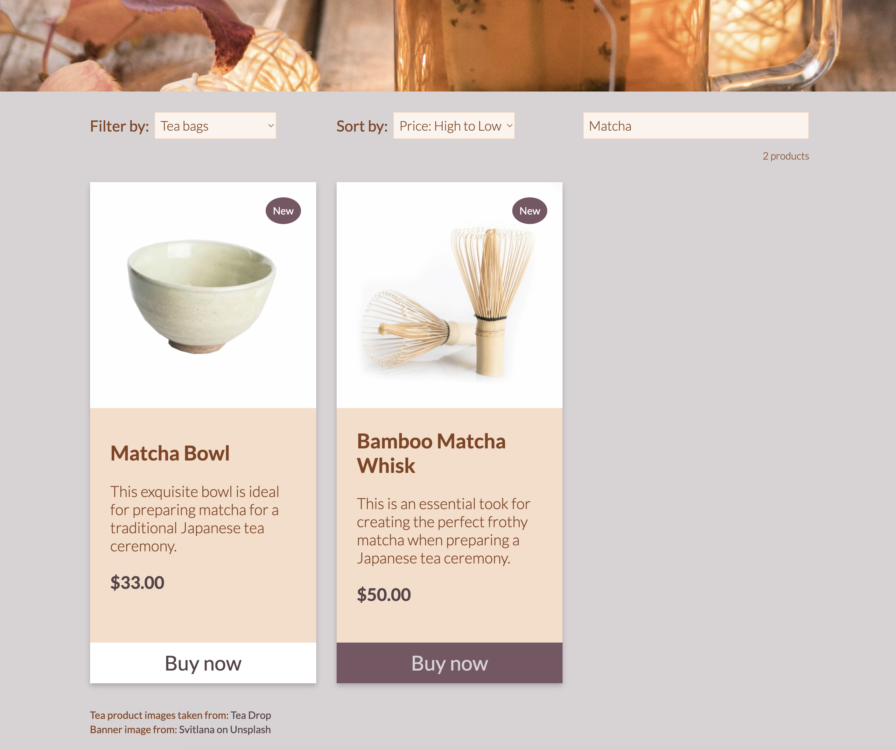

# 01 Project - Online Shop - QUALITEA

This was a project for Developers Institute. Boilerplate code was provided for the base of the React app. I coded all CSS. 

An online shop, QUALITEA, selling quality teas and tea accessories, such as teapots and herbal tea bags.\
Customers can select the products they wish to purchase and they will be taken to an online checkout in Stripe to pay via credit card.\
The webpage has the following features:

- Products can be filtered by category (tea bags or tea accessories).
- Products can be sorted by price.
- The customer can search for products by name using the search bar.
- The number of products resulting from a search will be displayed.
- Products featured as "new" will have a label on the product card.

## Screenshot of QUALITEA website

## Screenshot of search function

## Dependencies

This project uses the following systems:

- [Stripe](https://stripe.com/)
- [React](https://github.com/facebook/react)
- [Begin](https://begin.com/)

## Dev dependencies

- [Prettier](https://prettier.io/)
- [Stylelint](https://stylelint.io/)
- [ESLint](https://eslint.org/)

## Prerequisites

- [Node](https://nodejs.org/)

## Local development

1. Run `npm install`
2. Run `npm start` to start the development server
3. Open `src/App.js` to get started

## Deployed applications

- [QUALITEA](https://qualitea.netlify.app/)
- [BEGIN API URL](https://music-2o5-staging.begin.app)

## Citations

- Favicon downloaded from: [Flaticon - Green tea icons created by monkik](https://www.flaticon.com/free-icons/green-tea)
- Product images taken from: [Teadrop](https://www.teadrop.com.au/)
- Header image from: [Unsplash - Photo by Svitlana](https://unsplash.com/photos/eXw6CPGWwcg)
- Logo created on: [Canva](https://www.canva.com/)
